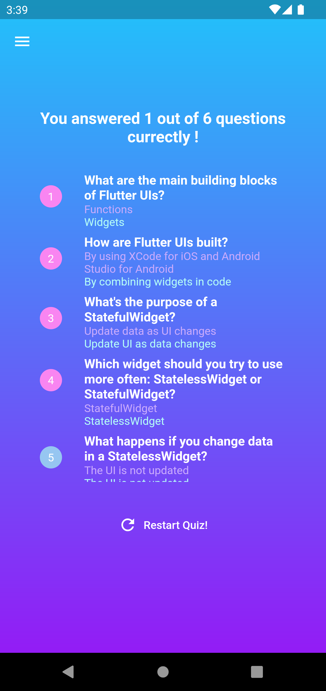

# udemy_flutter_dart_the_complete_guide_course_demo

A Flutter project followed by udemy course practices with some modification.

[Course Link](https://www.udemy.com/course/learn-flutter-dart-to-build-ios-android-apps/)

## Screenshots
### Roll dice
<table>
  <tr>
    <td></td>
  </tr>
</table>

### Quiz
<table>
  <tr>
    <td></td>
    <td></td>
    <td></td>
  </tr>
</table>

### Expanse tracker
<table>
  <tr>
    <td></td>
  </tr>
</table>

### Meals
<table>
  <tr>
    <td></td>
    <td></td>
    <td></td>
  </tr>
</table>

### Your Groceries
<table>
  <tr>
    <td></td>
    <td></td>
  </tr>
</table>

### Your Places
<table>
  <tr>
    <td></td>
    <td></td>
    <td></td>
    <td></td>
  </tr>
</table>

### Chat
<table>
  <tr>
    <td></td>
  </tr>
</table>
